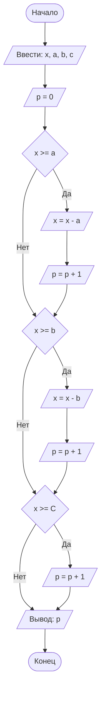

## Отчет по лабораторной работе № 1

#### № группы: `ПМ-2403`

#### Выполнил: `Шпак Ксения Максимовна`

#### Вариант: `30`

### Cодержание:
- [Постановка задачи](#1-постановка-задачи)
- [Входные и выходные данные](#2-входные-и-выходные-данные)
- [Выбор структуры данных](#3-выбор-структуры-данных)
- [Алгоритм](#4-алгоритм)
- [Программа](#5-программа)
- [Анализ правильности решения](#6-анализ-правильности-решения)
### 1. Постановка задачи

> Программа получает на вход 4 натуральных числа X, A, B, C. Три покупателя стоят в очереди за бананами.
> Они планируют купить A, B, C килограмм бананов соответственно порядку в очереди. Если к моменту,
> когда приходит его очередь, в магазине не остается нужного покупателю
> количества бананов, покупатель уходит, ничего не купив. Изначально в
> магазине имеется X кг бананов. Вывести нужно, сколько покупателей сможет купить бананы, которые они планируют.

Чтобы решить данную задачу, введём счетчик покупателей P и будем сравнивать колличество бананов в магазине Х, с колличеством бананов которое 
хочет купить каждый покупатель. Если Х больше или равно, то к счетчику прибавляем 1 - покупатель уходит с бананми, а Х присваем
разность - бананов в магазине стало меньше. Так как покупателей трое и они идут по очереди, проделаем это с каждым из чисел A,B,C.
В конце выводим Р.

### 2. Входные и выходные данные

#### Данные на вход

На вход программа должна получать 4 целых числа, при этом в условии не сказано, является ли Х неотрицательным, а A,B и C
положительными согласно здравому смыслу. Однако в магазине не может лежать -3 киограмма бананов, так же как и покупатель не может 
сказать продайте мне -5 килограммов. Купить 0 килограммов бананов так же нельзя, поэтому скажем, что число Х неотрицательно, а 
числа A, B и C положительны.

|             | Тип         | min значение | max значение      |
|-------------|-------------|--------------|-------------------|
| X (Число 1) | Целое число |0             | 2<sup>31</sup> - 1|
| A (Число 2) | Целое число |1             | 2<sup>31</sup> - 1|
| B (Число 1) | Целое число |1             | 2<sup>31</sup> - 1|
| C (Число 2) | Целое число |1             | 2<sup>31</sup> - 1|

#### Данные на выход

Т.к. программа должна вывести колличество покупателей от 0 до 3, то на выход мы получим
единственное целое неотрицательное число, не превышающее 3.

|             | Тип                         | min значение | max значение   |
|-------------|-----------------------------|--------------|----------------|
| P (Число 1) | Целое неотрицательное число | 0            | 3              |

### 3. Выбор структуры данных

Программа получает 4 целых числа, не превышающих по модулю 2<sup>31</sup> - 1. Поэтому для их хранения
можно выделить 4 переменных (`x`, `a`, `b`, `c`) типа `int`. Для вывода выделим переменную `p`.

|             | название переменной | Тип (в Java) | 
|-------------|---------------------|--------------|
| X (Число 1) | `x`                 | `int`        |
| A (Число 1) | `a`                 | `int`        |
| B (Число 1) | `b`                 | `int`        |
| C (Число 1) | `c`                 | `int`        |
| P (Число 1) | `p`                 | `int`        |

### 4. Алгоритм

#### Алгоритм выполнения программы:

1. **Ввод данных:**  
   Программа считывает 4 целых числа, обозначенные как `x`, `a`, `b`, `c`.
2. **Инициализация счетчика:**
   Счетчик `р` = 0
4. **Сравнение чисел:**  
   Программа сравнивает значения `x` и `а`. Если `x` больше или равно `а`, программа переходит к следующему шагу для
   работы с `x` и `р`. Если `а` больше, программа сравнивает `х` со следующим числом.
5. **Новое значение Х и Р:**
    - Если число `x` больше или равно `а`, `х` присвается значение (х - а), к счетчику прибавляется 1.
    - Если `х` меньше, ничего не происходит
6. **Повторение пунктов 4 и 5 для числа  `b`**
7. **Повторение пунктов 4 и 5 для числа  `с`**
8. **Вывод результата:**  
   На экран выводится колличество покупателей, купивших бананы
#### Блок-схема

### 5. Программа

```java
import java.io.PrintStream;
import java.util.Scanner;
public class Main {
    public static Scanner in = new Scanner(System.in);
    public static PrintStream out = System.out;
    public static void main(String[] args) {
        int x = in.nextInt();
        int a = in.nextInt();
        int b = in.nextInt();
        int c = in.nextInt();
        int p = 0;
        if (x >= a) {
            x = x - a;
            p = p + 1;
        }
        if (x >= b) {
            x = x - b;
            p = p + 1;
        }
        if (x>= c) {
            p = p + 1;
        }
        out.println(p);
    }
}
```
### 6. Анализ правильности решения
1. Тест на `X > (A+B+C) `:
   - **Input**:
        ```
        20 4 5 6
        ```

    - **Output**:
        ```
        3
        ```
2. Тест на `X < (A+B+C), A>B>C `. Купили A,B:
   - **Input**:
        ```
        20 15 4 3
        ```

    - **Output**:
        ```
        2
        ```
3. Тест на `X < (A+B+C), A>B>C `. Купили B, C:
   - **Input**:
        ```
        6 15 3 2
        ```

    - **Output**:
        ```
        2
        ```
4. Тест на `X < (A+B+C), B>A>C `. Купили A,B:
   - **Input**:
        ```
        20 4 15 3
        ```

    - **Output**:
        ```
        2
        ```
5. Тест на `X < (A+B+C), B>A>C `. НЕ купили :
   - **Input**:
        ```
        20 40 150 30
        ```

    - **Output**:
        ```
        0
        ```
